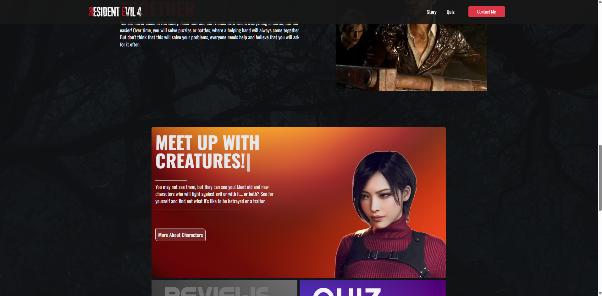
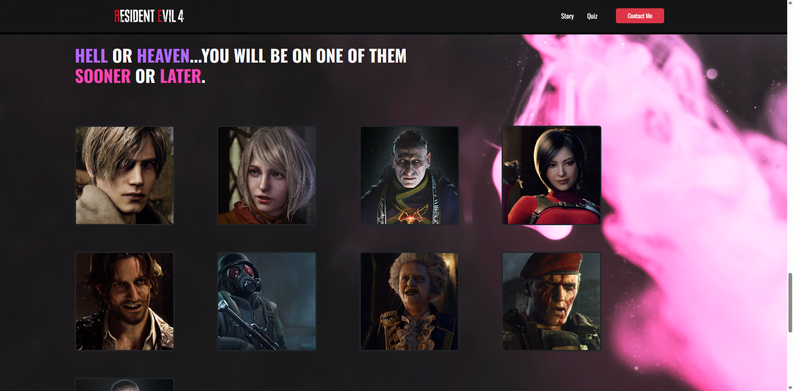
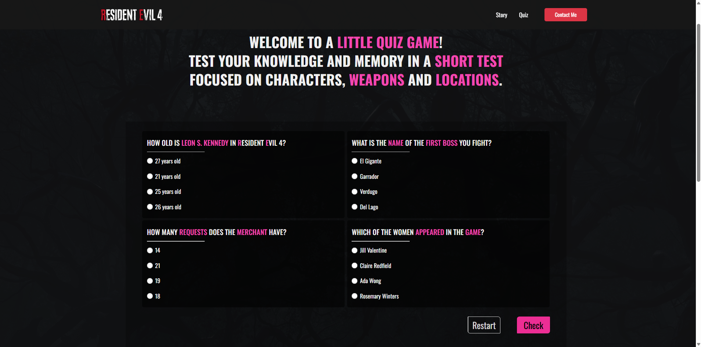

# Resident Evil 4 Wiki

---

---

A simple project designed to showcase key information about the action-packed game Resident Evil 4. This webpage is primarily focused on design, incorporating smooth animations and intuitive user interfaces. The application features dynamic content sections, including an interactive story overview that provides an in-depth look at the game's plot. Additionally, it offers a short, interactive quiz, allowing users to test their knowledge of the game in a fun and engaging way.

## 🕹️ Live Demo

[Check out the live demo here](https://kubanec01.github.io/ResidentEvil4Wiki/)

## 🛠 Technologies Used

- React + Vite
- TypeScript
- Tailwind CSS
- Framer Motion
- Bootstrap

## 🔧 Installation

To run the project locally, follow these steps:

1. Clone the repository:

   - `git clone https://github.com/Kubanec01/ResidentEvil4Wiki`

2. Navigate to the project directory:

   - `cd Resident-Evil-4-App`

3. Install the dependencies:

   - `npm install`

4. Run the app locally:
   - `npm run dev`

Once the app is running, open your browser and go to `http://localhost:3000` to view the app in action.
